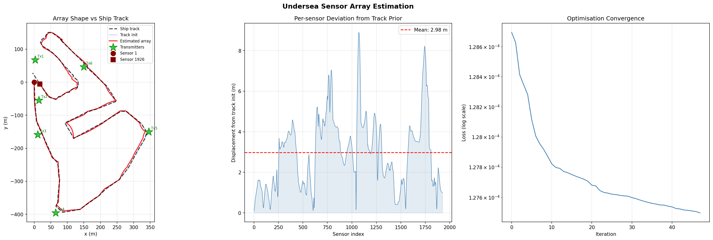
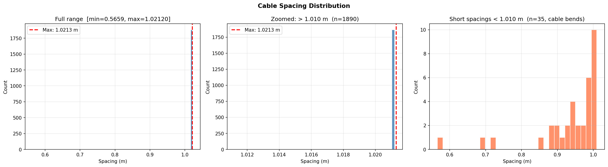

# Methodology & Results

Estimating the shape of an undersea acoustic sensor array from time-difference-of-arrival (TDOA) measurements.

## 1. Setting

A cable of 1,926 sensors lies on the seabed at 20 m depth. It was deployed from a ship, so its intended path is the ship's GPS track, but currents may have moved it. Six transmitters at known (x, y) positions and 2 m depth each fired twice, and every sensor recorded the arrival times. The firing times are unknown. The cable can't stretch: consecutive sensors are at most **1.0213 m** apart.

**Unknowns:** the (x, y) position of every sensor.

## 2. Forward model

With sensor *i* at $(x_i, y_i)$ and transmitter *k* at $(X_k, Y_k)$, the vertical offset is $\Delta z = 18$ m and

$$d_{ik} = \sqrt{(x_i - X_k)^2 + (y_i - Y_k)^2 + \Delta z^2}, \qquad \tau_{ik} = \frac{d_{ik}}{c} + t_{0,k}$$

with $c = 1540$ m/s and $t_{0,k}$ the unknown firing time of transmitter *k*.

**Removing $t_0$.** $t_{0,k}$ is identical for every sensor, so subtracting a per-transmitter reference across sensors cancels it. The two repeat firings of each transmitter are averaged first, which cuts timing noise by about $\sqrt{2}$ and leaves 6 observations per sensor.

## 3. Initial layout

Sensors are placed at equal arc-length spacing along the ship track by linear interpolation. The arc length is capped at the maximum physical cable length (about 1,966 m), because the raw track (about 2,007 m) would give starting spacings already above the limit.

## 4. Cable parameterisation

Optimising 1,926 free (x, y) points could produce physically impossible cables. Instead the cable is built sequentially from an anchor point $s_1$, segment lengths $l_i$ and segment angles $\theta_i$:

$$s_{i+1} = s_i + l_i \begin{bmatrix}\cos\theta_i \\ \sin\theta_i\end{bmatrix}, \qquad l_i = l_{\max}\,\sigma(u_i), \quad l_{\max} = 1.0213\ \text{m}$$

where $u_i$ is unconstrained and $\sigma$ is the logistic sigmoid. Every spacing is then **guaranteed** to be below $l_{\max}$, the cable stays connected, and the whole map from parameters to positions is differentiable. The optimiser has about 3,850 parameters (anchor, 1,925 lengths, 1,925 angles and the six time offsets).

## 5. Loss function

$$\mathcal{L} = \underbrace{\frac{1}{6N}\sum_{i,k} w_i\,\rho_\delta\!\left(\hat{\Delta\tau}_{ik} - \Delta\tau_{ik}\right)}_{\text{data}} \;+\; \lambda\,\underbrace{\frac{1}{N}\sum_i \lVert s_i - s_i^{\text{init}}\rVert^2}_{\text{track prior}}$$

- **Huber loss $\rho_\delta$** ($\delta = 5$ ms, about 7.7 m of range): quadratic for small residuals, linear for large ones, so a few corrupted measurements can't dominate.
- **Sensor weights $w_i$.** Each transmitter fired twice from the same place, so the difference of the two arrival times should be constant across all sensors. A sensor's deviation from the median difference measures its timing noise. Weights decay as a Gaussian of this noise score and are floored at 0.05, so noisy sensors are down-weighted rather than discarded.
- **Track prior.** A weak pull toward the ship-track initialisation with $\lambda = 10^{-7}$. This value was chosen from a gradient comparison: at $\lambda = 10^{-4}$ the prior gradient was about 100× the acoustic gradient and the optimisation barely moved. At $10^{-7}$ the acoustic data dominates and the prior only stabilises the solution.

## 6. Optimisation

L-BFGS-B (SciPy). It is a quasi-Newton method with limited memory, which suits a smooth problem with thousands of parameters.

## 7. Results

| Metric | Value |
|---|---|
| Spacing constraint violations | **0** |
| Mean / max spacing | 1.0196 m / 1.0212 m |
| Shortest spacing | 0.566 m |
| Short spacings (< 1.010 m) | 35 of 1,925 |
| Mean displacement from ship track | ≈ 3 m |

- **Shape.** The estimated array follows the ship track closely, with local deviations of a few metres, up to roughly 9 m in the largest excursions. This is consistent with current-driven drift during deployment.
- **Deviation profile.** Displacement is not uniform: it rises in a few distinct stretches of the cable (around sensors 650–800, 1050, 1250 and 1750) and is small elsewhere.
- **Spacing.** The cable is almost entirely taut: 1,890 of 1,925 segments are longer than 1.010 m, just under the 1.0213 m limit.

- **Short segments** (35) cluster at bends in the cable, where adjacent sensors are pulled closer together, and are not an artefact of the optimiser.
- **Convergence.** In the run shown, the loss decreased smoothly from about $1.287\times10^{-4}$ to $1.275\times10^{-4}$ without instability.

## 8. Limitations

- There is no ground truth for the sensor positions, so quality is judged by consistency (fit to the TDOAs, satisfied cable constraint, plausible drift) rather than by position error.
- The model assumes a constant sound speed and a flat seabed at known depth, ignoring refraction and depth variation.
- The problem is solved in 2D, with sensor and transmitter depths fixed.
- The optimiser finds a local minimum, so the result depends on the track-based initialisation.
